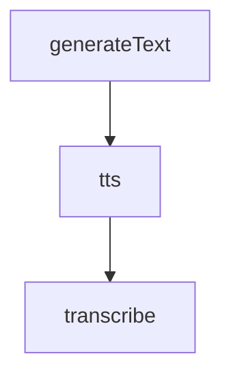
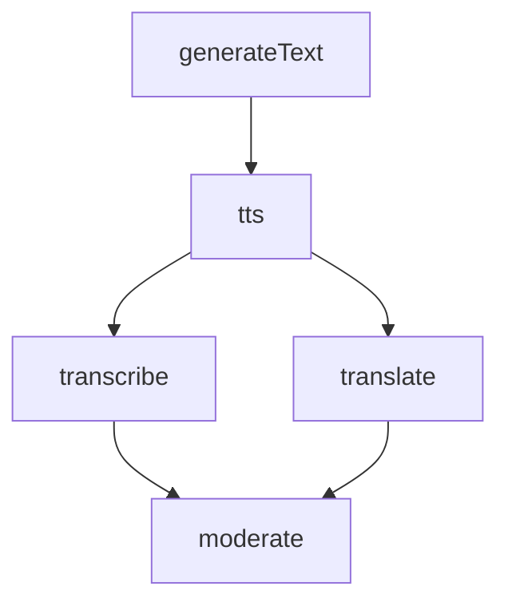

# ProviderPlaneAI

[](https://www.npmjs.com/package/providerplaneai)
[](https://www.npmjs.com/package/providerplaneai)
[](LICENSE)
[](https://github.com/providerplaneai/providerplaneai/actions)
[](https://www.providerplane.dev)

ProviderPlaneAI is a workflow-first AI orchestration framework for Node.js. It provides a provider-agnostic pipeline layer above raw model SDKs:

- Provider-agnostic orchestration across OpenAI, Anthropic, and Gemini, with additional providers planned
- Workflow-first API with jobs available as the lower-level execution layer
- Multimodal pipelines across text, audio, image, video, moderation, and embeddings
- Retry, fallback, persistence, and workflow-level observability

See [providerplane.dev](https://www.providerplane.dev) for the full API reference, advanced workflow patterns, and configuration guides.

---

<a id="getting-started"></a>
## Getting Started

### Install

```bash
npm install providerplaneai
```

### Runtime Requirements

- Node.js 20+
- TypeScript 5+

### Configure Providers

ProviderPlaneAI loads configuration via `node-config` + `dotenv`.

Create `config/default.json` (or environment-specific config files) with `appConfig` and `providers`.

Minimal example:

```json
{
  "appConfig": {
    "executionPolicy": {
      "providerChain": [
        { "providerType": "openai", "connectionName": "default" }
      ]
    }
  },
  "providers": {
    "openai": {
      "default": {
        "type": "openai",
        "apiKeyEnvVar": "OPENAI_API_KEY_1",
        "defaultModel": "gpt-5"
      }
    }
  }
}
```

Minimal `.env` for the config above:

```bash
OPENAI_API_KEY_1=your_openai_api_key
```

For full multi-provider config and environment examples covering OpenAI, Gemini, Anthropic, and Voyage, see [providerplane.dev](https://www.providerplane.dev).

### Quickstart

```ts
import {
  AIClient,
  MultiModalExecutionContext,
  Pipeline,
  WorkflowRunner
} from "providerplaneai";

const client = new AIClient();
const runner = new WorkflowRunner({ jobManager: client.jobManager, client });
const ctx = new MultiModalExecutionContext();

const pipeline = new Pipeline<{
  generatedText: string;
  transcriptText: string;
  audioArtifactId: string;
}>("readme-workflow-1", {});

// Typed step handles keep `source` and `after` references readable and safe
const generateText = pipeline.step("generateText");
const tts = pipeline.step("tts");
const transcribe = pipeline.step("transcribe");

// Build a workflow: chat -> tts -> transcribe
const workflow = pipeline
  .chat(generateText.id, "Generate one short inspirational quote in French.", {
    normalize: "text"
  })
  .tts(tts.id, { voice: "alloy", format: "mp3" }, { source: generateText })
  .transcribe(transcribe.id, { responseFormat: "text" }, { source: tts, normalize: "text" })
  .output((values) => ({
    generatedText: String(values.generateText ?? ""),
    transcriptText: String(values.transcribe ?? ""),
    audioArtifactId: String(((values.tts as any[])?.[0]?.id ?? ""))
  }))
  .build();

// Run the workflow
const execution = await runner.run(workflow, ctx);

console.log("Output", execution.output);
```



For most applications, this is the right abstraction level: `Pipeline` plus `WorkflowRunner`.

Use direct jobs only when you need low-level control outside a workflow DAG, are integrating with an external scheduler, or are building custom orchestration on top of the library.

<a id="built-in-providers"></a>
## Built-In Providers

- OpenAI
- Anthropic
- Gemini

Providers listed in `appConfig.executionPolicy.providerChain` are initialized automatically when `AIClient` is constructed.

<a id="workflow-system"></a>
## Workflow System

ProviderPlaneAI includes a DAG workflow engine for orchestrating multi-step AI workflows. `Pipeline` is the recommended authoring API. `WorkflowBuilder` remains available for advanced node-level control.

### Workflow capabilities

- Deterministic DAG execution with explicit dependencies
- Parallel fan-out and fan-in
- Single-source and multi-source step inputs via `source`
- Conditional step execution via `when`
- Per-step retry and timeout policies
- Per-step provider and provider-chain overrides
- Streaming and non-streaming workflow nodes
- Nested workflows
- Export to JSON, Mermaid, DOT, and D3

### Core APIs

- `Pipeline` for most workflows
- `WorkflowRunner` for execution
- `WorkflowExporter` for visualization and export
- `WorkflowBuilder` for advanced custom graph construction

### Pipeline DSL (recommended)

```ts
const client = new AIClient();
const runner = new WorkflowRunner({ jobManager: client.jobManager, client });
const ctx = new MultiModalExecutionContext();

const pipeline = new Pipeline<{
  generatedText: string;
  transcriptText: string;
  translationText: string;
  moderationFlagged: boolean;
}>("readme-workflow-2", {});

// Typed step handles keep `source` and `after` references readable and safe
const generateText = pipeline.step("generateText");
const tts = pipeline.step("tts");
const transcribe = pipeline.step("transcribe");
const translate = pipeline.step("translate");
const moderate = pipeline.step("moderate");

// Build a workflow: chat -> tts -> transcribe + translate -> moderate
const workflow = pipeline
  .chat(generateText.id, "Generate one short inspirational quote in French.", { normalize: "text" })
  .tts(tts.id, { voice: "alloy", format: "mp3" }, { source: generateText })
  .transcribe(transcribe.id, { responseFormat: "text" }, { source: tts, normalize: "text" })
  .translate(translate.id, { targetLanguage: "english", responseFormat: "text" }, { source: tts, normalize: "text" })
  .moderate(moderate.id, {}, { source: [transcribe, translate] })
  .output((values) => ({
    generatedText: String(values.generateText ?? ""),
    transcriptText: String(values.transcribe ?? ""),
    translationText: String(values.translate ?? ""),
    moderationFlagged: Boolean((values.moderate as any)?.[0]?.flagged ?? false)
  }))
  .build();

// Run the workflow
const execution = await runner.run(workflow, ctx);

console.log("Output", execution.output);
```

Notes:
- `source` binds step input to upstream output and can be either a single step or an array of steps.
- `after` adds ordering dependencies when you need sequencing without data binding.
- Typed step handles created with `pipeline.step("...")` reduce stringly-typed wiring mistakes.
- `custom(...)` and `customAfter(...)` are escape hatches for custom capability steps without dropping to `WorkflowBuilder`.
- If you find yourself reaching for `createCapabilityJob` in application code, you are usually below the preferred abstraction level.



For the full `Pipeline` method reference and step-by-step DSL documentation, see [providerplane.dev](https://www.providerplane.dev).

### Built-in workflow-oriented capabilities

- `approvalGate`
- `saveFile`

These are registered by default and are intended for workflow authoring rather than provider-specific model calls.

### Advanced workflow APIs

- Use `WorkflowBuilder` when you need direct node functions or full control over graph construction.
- Use `WorkflowExporter` to render workflows as Mermaid, DOT, D3, or JSON.
- Keep advanced builder/export usage in docs and internal tooling; use `Pipeline` for the common path.

---

<a id="development"></a>
## Development

```bash
npm run build
npm run test
npm run lint
npm run perf:quick
```

### Integration testing

- Deterministic integration tests:
  - `npm run test:integration`
- Provider-backed live integration tests:
  - `RUN_WORKFLOW_LIVE_INTEGRATION=1 npm run test:integration:live`
  - requires `OPENAI_API_KEY_1`, `GEMINI_API_KEY_1`, and `ANTHROPIC_API_KEY_1`

Performance artifacts are generated under `scripts/perf/results` as both JSON and Markdown:
- `npm run perf:quick` (5 cold-import runs)
- `npm run perf` (20 cold-import runs)
- `npm run perf:full` (30 cold-import runs)
- `npm run perf:ci` (30 runs + CI threshold checks; exits non-zero on regression)

### Publishing notes

Published tarballs intentionally exclude local development entry files and other non-runtime artifacts. Release packaging is constrained through both the TypeScript release build config and the `files` allowlist in `package.json`.

### Git hooks
We use Husky to enforce linting and tests.
Please do not bypass hooks unless absolutely necessary.

---

<a id="open-source-and-contributions"></a>
## Open Source and Contributions

ProviderPlaneAI is open source and designed to support real-world engineering teams. Contributions, feedback, and discussion are welcome.

If you are interested in contributing or collaborating, feel free to open an issue or discussion.

---

<a id="license"></a>
## License

MIT
