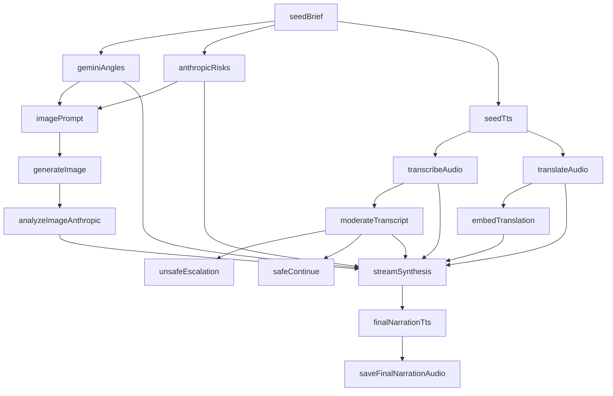

# ProviderPlaneAI

[](https://www.npmjs.com/package/providerplaneai)
[](https://www.npmjs.com/package/providerplaneai)
[](LICENSE)
[](https://github.com/providerplaneai/providerplaneai/actions)
[](https://www.providerplane.dev)

**ProviderPlaneAI** is a workflow-first, provider-agnostic AI orchestration framework designed for building scalable, resilient, and observable AI applications.

It focuses on modern AI system challenges such as streaming, multimodal pipelines, fallback strategies, execution tracing, and asynchronous workflows while remaining extensible and production-ready.

API documentation: [www.providerplane.dev](https://www.providerplane.dev)

## Table of Contents

- [Key Concepts](#key-concepts)
- [Core Features](#core-features)
- [Example Use Cases](#example-use-cases)
- [Getting Started](#getting-started)
- [Built-In Providers](#built-in-providers)
- [Design Goals](#design-goals)
- [Workflow System](#workflow-system)
- [Development](#development)
- [Open Source and Contributions](#open-source-and-contributions)
- [License](#license)

---

<a id="key-concepts"></a>
## Key Concepts 🧠

### Workflow-First Architecture 🧩

ProviderPlaneAI treats workflows as the primary API and jobs as the execution substrate (middle layer). This enables:
- High-level DAG orchestration as the default developer experience
- Asynchronous and synchronous execution
- Retry, rerun, and persistence support
- Concurrency and queue control
- Observability and lifecycle tracking
- Streaming and non-streaming execution under a unified model

### Capability-Based Design 🔌

Instead of tying your system to specific vendors, ProviderPlaneAI routes requests through **capabilities**, allowing:
- Provider-agnostic execution
- Clean abstraction and extensibility
- Custom capability integration
- Easy fallback across providers

### Streaming and Multimodal Pipelines 🌊

The framework natively supports:
- Streaming responses
- Incremental artifact generation
- Multimodal workflows (text, images, embeddings, moderation, analysis)
- Unified execution context and timeline tracking

### Resilience and Fallback 🛡️

Execution policies allow:
- Automatic fallback across providers
- Structured error handling
- Robust distributed AI pipelines

### Observability and Tracing 🔍

ProviderPlaneAI is designed with observability in mind:
- Execution metadata
- Structured job snapshots
- Streaming diagnostics
- Timeline-based artifact tracking

---

<a id="core-features"></a>
## Core Features ✨

- Provider-agnostic AI orchestration
- Workflow-first orchestration model (with jobs as internal/advanced layer)
- Streaming and non-streaming support
- Multimodal artifact pipelines
- Execution policies and fallback
- Observability and metadata tracking
- Extensible capability system
- Strong TypeScript typing
- Cloud and platform-friendly architecture
- OSS-friendly and framework-agnostic

---

<a id="example-use-cases"></a>
## Example Use Cases 🏗️

- AI platform and infrastructure teams
- Agent orchestration systems
- AI product backends
- Multimodal pipelines
- Distributed and resilient AI services
- Internal AI developer platforms

---

<a id="getting-started"></a>
## Getting Started 🚀

### Install 📦

```bash
npm install providerplaneai
```

### Runtime Requirements ✅

- Node.js 20+
- TypeScript 5+

### Configure Providers ⚙️

ProviderPlaneAI loads configuration via `node-config` + `dotenv`.

Create `config/default.json` (or environment-specific config files) with `appConfig` and `providers`.

Minimal example:

```json
{
  "appConfig": {
    "maxConcurrency": 128,
    "maxQueueSize": 1024,
    "maxStoredResponseChunks": 1024,
    "storeRawResponses": true,
    "maxRawBytesPerJob": 1048576,
    "remoteImageFetchTimeoutMs": 16384,
    "maxRemoteImageBytes": 10485760,
    "executionPolicy": {
      "providerChain": [
        { "providerType": "openai", "connectionName": "default" },
        { "providerType": "gemini", "connectionName": "default" },
        { "providerType": "anthropic", "connectionName": "default" }
      ]
    }
  },
  "providers": {
    "openai": {
      "default": {
        "type": "openai",
        "apiKeyEnvVar": "OPENAI_API_KEY_1",
        "defaultModel": "gpt-5",
        "defaultModels": { "chat": "gpt-5" },
        "providerDefaults": { "providerParams": {} },
        "models": {
          "gpt-5": {
            "chat": {
              "modelParams": {},
              "providerParams": {},
              "generalParams": {}
            },
            "chatStream": {
              "modelParams": {},
              "providerParams": {},
              "generalParams": { "chatStreamBatchSize": 64 }
            }
          }
        }
      }
    }
  }
}
```

Set environment variables referenced by `apiKeyEnvVar` (for example `OPENAI_API_KEY_1`, `GEMINI_API_KEY_1`, `ANTHROPIC_API_KEY_1`).

### Basic Usage (Workflow-First) 💡

```ts
import {
  AIClient,
  MultiModalExecutionContext,
  Pipeline,
  WorkflowRunner
} from "providerplaneai";

const client = new AIClient();
const runner = new WorkflowRunner({ jobManager: client.jobManager, client });

const workflow = new Pipeline<{ text: string }>("quickstart-workflow")
  .chat("ask", "Say hello in one sentence.")
  .output((values) => ({ text: String(values.ask) }))
  .build();

const execution = await runner.run(workflow, new MultiModalExecutionContext());
console.log(execution.output?.text);
```

### Advanced Usage (Direct Job API) ⚙️
Use direct jobs when you need fine-grained low-level control outside a workflow DAG.

```ts
import {
  AIClient,
  CapabilityKeys,
  MultiModalExecutionContext,
  type ClientChatRequest,
  type NormalizedChatMessage
} from "providerplaneai";

const client = new AIClient();

const request: ClientChatRequest = {
  messages: [
    {
      role: "user",
      content: [{ type: "text", text: "Hello" }]
    }
  ]
};

const job = client.createCapabilityJob<
  typeof CapabilityKeys.ChatCapabilityKey,
  ClientChatRequest,
  NormalizedChatMessage
>(CapabilityKeys.ChatCapabilityKey, { input: request });

const ctx = new MultiModalExecutionContext();
client.jobManager.runJob(job.id, ctx);

const result = await job.getCompletionPromise();
console.log(result);
```

### Streaming Usage 📡

```ts
import {
  AIClient,
  CapabilityKeys,
  MultiModalExecutionContext,
  type ClientChatRequest,
  type JobChunk,
  type NormalizedChatMessage
} from "providerplaneai";

const client = new AIClient();

const request: ClientChatRequest = {
  messages: [
    {
      role: "user",
      content: [{ type: "text", text: "Stream this response" }]
    }
  ]
};

const job = client.createCapabilityJob<
  typeof CapabilityKeys.ChatStreamCapabilityKey,
  ClientChatRequest,
  NormalizedChatMessage
>(CapabilityKeys.ChatStreamCapabilityKey, { input: request });

const ctx = new MultiModalExecutionContext();
client.jobManager.runJob(job.id, ctx, (chunk: JobChunk<NormalizedChatMessage>) => {
  if (chunk.delta?.content?.[0]?.type === "text") {
    process.stdout.write(chunk.delta.content[0].text);
  }
});

await job.getCompletionPromise();
```

---

<a id="built-in-providers"></a>
## Built-In Providers 🤝

#### Current providers:
- OpenAI
- Anthropic
- Gemini

Additional providers will be added in the future.

Providers are auto-registered from `appConfig.executionPolicy.providerChain` during `AIClient` construction.

---

<a id="design-goals"></a>
## Design Goals 🎯

ProviderPlaneAI is built around several guiding principles:

- **Abstraction without loss of control**
- **Streaming-first and multimodal-ready**
- **Resilient distributed execution**
- **Clear observability and traceability**
- **Extensibility and long-term maintainability**
- **Production-focused architecture**

---

<a id="workflow-system"></a>
## Workflow System

ProviderPlaneAI includes a DAG workflow engine on top of the job system.

### Workflow capabilities

- Deterministic DAG execution with explicit dependencies
- Parallel fan-out and fan-in aggregation
- Conditional step execution (`condition`)
- Per-node retry and timeout policies
- Provider-chain override per workflow step
- Streaming node support with workflow-level chunk hooks
- Nested workflows
- Persistence + resume support
- Export to JSON, Mermaid, DOT, and D3 graph formats

### Core APIs

- `Pipeline` (`src/core/workflow/Pipeline.ts`) as the recommended DSL
- `WorkflowBuilder` (`src/core/workflow/WorkflowBuilder.ts`)
- `WorkflowRunner` (`src/core/workflow/WorkflowRunner.ts`)
- `WorkflowExporter` (`src/core/workflow/WorkflowExporter.ts`)

### Pipeline DSL (recommended)

Use `Pipeline` for most workflows. It hides request-shape boilerplate and keeps dependencies explicit.

```ts
import { AIClient, MultiModalExecutionContext, Pipeline, WorkflowRunner } from "providerplaneai";

const client = new AIClient();
const runner = new WorkflowRunner({ jobManager: client.jobManager, client });

const pipeline = new Pipeline<{ text: string }>("pipeline-example");
const seed = pipeline.step("seed");
const seedAudio = pipeline.step("seedAudio");
const seedTranscript = pipeline.step("seedTranscript");

const workflow = pipeline
  .chat(seed.id, "Say one sentence about resilient workflows.")
  .tts(seedAudio.id, { voice: "alloy", format: "mp3" }, { source: seed })
  .transcribe(seedTranscript.id, { responseFormat: "text" }, { source: seedAudio })
  .moderate("riskCheck", {}, { source: seedTranscript })
  .chat(
    "summary",
    "Summarize in one sentence:\n{{seedTranscript}}",
    { after: [seedTranscript, "riskCheck"] }
  )
  .output((values) => ({ text: String(values.summary) }))
  .build();

const execution = await runner.run(workflow, new MultiModalExecutionContext());
console.log(execution.output?.text);
```

Notes:
- `source` binds step input to prior step output.
- `after` adds extra ordering dependencies.
- If both are present, dependencies are merged and deduplicated.
- `normalize` can adapt raw provider output into stable shapes (`text`, `artifact`, `image`, or custom fn).

### Pipeline DSL Cheat Sheet

| Method | Use for | Typical input | Key options |
|---|---|---|---|
| `chat(id, prompt, opts?)` | Non-streaming text generation | Prompt string or `(values) => string` | `after`, `provider/providerChain`, `requestOverrides`, `inputOverrides`, `normalize` |
| `chatStream(id, prompt, opts?)` | Streaming text generation | Prompt string or `(values) => string` | `after`, `provider/providerChain`, `requestOverrides`, `inputOverrides`, `normalize` |
| `tts(id, input, { source, ...opts })` | Text-to-speech from prior text step | `{ voice?, format?, instructions? }` | `source`, `after`, `provider/providerChain` |
| `transcribe(id, input, { source, ...opts })` | Speech-to-text from prior audio artifact | `{ filename?, responseFormat? }` | `source`, `after`, `provider/providerChain` |
| `translate(id, input, { source, ...opts })` | Audio translation from prior audio artifact | `{ filename?, targetLanguage?, responseFormat? }` | `source`, `after`, `provider/providerChain` |
| `moderate(id, {}, { source, ...opts })` | Text moderation on prior text output | `{}` | `source`, `after`, `provider/providerChain` |
| `embed(id, input, opts?)` | Embeddings from text or prior step | `{ text?, purpose? }` | `source` (optional), `after`, `provider/providerChain` |
| `imageGenerate(id, input, opts?)` | Image generation from prompt | `{ prompt?, params? }` | `source` (optional), `after`, `provider/providerChain` |
| `imageAnalyze(id, input, { source, ...opts })` | Image analysis from prior image step | `{ prompt? }` | `source`, `after`, `provider/providerChain` |
| `videoGenerate(id, input, opts?)` | Video generation from prompt | `{ prompt?, params? }` | `source` (optional), `after`, `provider/providerChain` |
| `videoRemix(id, input, opts?)` | Video remix from source video/artifact | `{ sourceVideoId?, prompt?, params? }` | `source` (optional), `after`, `provider/providerChain` |
| `videoDownload(id, input, opts?)` | Download/resolve video artifact | `{ videoUri?, videoId?, variant? }` | `source` (optional), `after`, `provider/providerChain` |
| `videoAnalyze(id, input, { source, ...opts })` | Video analysis from one or more sources | `{ prompt?, params? }` | `source` (single or array), `after`, `provider/providerChain` |
| `saveFile(id, input, { source, ...opts })` | Persist prior artifact/text to disk | `{ path: string | ({ artifact, values }) => string }` | `source`, `after` |
| `approvalGate(id, input, opts?)` | Human/system approval checkpoint | `{ input: object | (values) => object }` | `after`, `provider/providerChain` |
| `custom(...)` / `customAfter(...)` | Escape hatch for custom capability steps | Raw capability request/factory | Full control via raw capability + options |
| `output(mapper)` / `aggregate(mapper)` | Final workflow output mapping | `(values/results, state?) => output` | Final output shaping |

### Recommended Patterns

- Prefer `Pipeline` for most workflows; use `WorkflowBuilder` only when you need raw node-level control.
- Use stable, descriptive step IDs (`seedPrompt`, `riskCheck`, `finalSummary`) because IDs are used in templates (`{{stepId}}`) and debugging.
- Use typed step handles (`const s = pipeline.step("seed")`) for dependencies to reduce stringly-typed wiring mistakes.
- Use `source` for data binding and `after` only for additional ordering constraints not already implied by `source`.
- Keep prompt templates simple; when composition gets complex, use function prompts: `(values) => string`.
- Normalize early when downstream steps need stable shapes across providers (`normalize: "text" | "artifact" | "image"`).
- Keep side effects (file writes, approval gates) near the tail of the graph to minimize retry duplication risk.
- Use `providerChain` per step only when that step needs custom fallback behavior; otherwise rely on workflow defaults.
- Use `.custom(...)`/`.customAfter(...)` as escape hatches, not the default path, to keep workflows readable.

### Low-level builder (advanced)

Use `WorkflowBuilder` when you need direct node-level control.

```ts
import {
  AIClient,
  CapabilityKeys,
  MultiModalExecutionContext,
  WorkflowBuilder,
  WorkflowRunner
} from "providerplaneai";

const client = new AIClient();
const runner = new WorkflowRunner({
  jobManager: client.jobManager,
  client,
  hooks: {
    onNodeChunk: (_workflowId, nodeId, chunk) => {
      if (typeof chunk.delta === "string") {
        process.stdout.write(`[${nodeId}] ${chunk.delta}`);
      }
    }
  }
});

const workflow = new WorkflowBuilder<{ finalText: string }>("example-workflow")
  .defaults({
    retry: { attempts: 2, backoffMs: 250 },
    timeoutMs: 45000
  })
  .capabilityNode(
    "draft",
    CapabilityKeys.ChatStreamCapabilityKey,
    {
      input: {
        messages: [{ role: "user", content: [{ type: "text", text: "Write one sentence about workflow reliability." }] }]
      },
      options: { model: "gpt-4.1" }
    },
    {
      providerChain: [
        { providerType: "openai", connectionName: "default" },
        { providerType: "gemini", connectionName: "default" }
      ]
    }
  )
  .capabilityAfter(
    "draft",
    "moderate",
    CapabilityKeys.ModerationCapabilityKey,
    (_ctx, state) => ({
      input: { text: String(state.values.draft) }
    })
  )
  .after(
    "moderate",
    "approval",
    (_ctx, nodeClient) =>
      nodeClient.createCapabilityJob(CapabilityKeys.ApprovalGateCapabilityKey, {
        input: { requestedAt: new Date().toISOString(), decision: { status: "approved", approver: "system" } }
      })
  )
  .aggregate((results) => ({
    finalText: String(results.draft)
  }))
  .build();

const execution = await runner.run(workflow, new MultiModalExecutionContext());
console.log(execution.status, execution.output);
```

### DSL escape hatch

`Pipeline` supports low-level integration when needed:

```ts
import { CapabilityKeys, Pipeline } from "providerplaneai";

const workflow = new Pipeline("dsl-escape-hatch")
  .chat("seed", "hello")
  .custom("custom1", "customCapability", { input: { value: 123 } })
  .customAfter("seed", "moderate", CapabilityKeys.ModerationCapabilityKey, (_ctx, state) => ({
    input: { input: String(state.values.seed) }
  }))
  .build();
```

### Built-in workflow-oriented capabilities

- `approvalGate` (`CapabilityKeys.ApprovalGateCapabilityKey`)
- `saveFile` (`CapabilityKeys.SaveFileCapabilityKey`)

These are registered by default in the capability executor registry.

### Workflow export

```ts
import { WorkflowExporter } from "providerplaneai";

const json = WorkflowExporter.workflowAsJSON(workflow);
const mermaid = WorkflowExporter.workflowAsMermaid(workflow);
const dot = WorkflowExporter.workflowAsDOT(workflow);
const d3 = WorkflowExporter.workflowAsD3(workflow);

// or via unified format selector
const anyFormat = WorkflowExporter.export(workflow, "mermaid");

// and optionally write to disk
await WorkflowExporter.exportToFile(workflow, "mermaid", "./test_data/workflows/example.mermaid");
```

### Example Workflow



### Integration testing

- Deterministic integration tests:
  - `npm run test:integration`
- Provider-backed live integration tests:
  - `RUN_WORKFLOW_LIVE_INTEGRATION=1 npm run test:integration:live`
  - requires `OPENAI_API_KEY_1`, `GEMINI_API_KEY_1`, and `ANTHROPIC_API_KEY_1`

---

<a id="development"></a>
## Development 🛠️

```bash
npm run build
npm run test
npm run lint
npm run perf:quick
```

Performance artifacts are generated under `scripts/perf/results` as both JSON and Markdown:
- `npm run perf:quick` (5 cold-import runs)
- `npm run perf` (20 cold-import runs)
- `npm run perf:full` (30 cold-import runs)
- `npm run perf:ci` (30 runs + CI threshold checks; exits non-zero on regression)

### Git Hooks 🪝
We use Husky to enforce linting and tests.
Please do not bypass hooks unless absolutely necessary.

---

<a id="open-source-and-contributions"></a>
## Open Source and Contributions 🌍

ProviderPlaneAI is open source and designed to support real-world engineering teams. Contributions, feedback, and discussion are welcome.

If you are interested in contributing or collaborating, feel free to open an issue or discussion.

---

<a id="license"></a>
## License 📄

MIT
